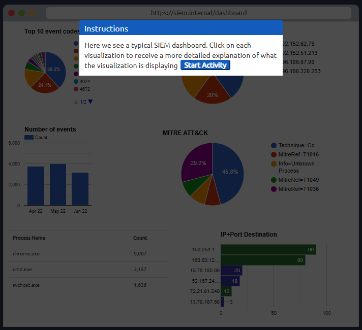
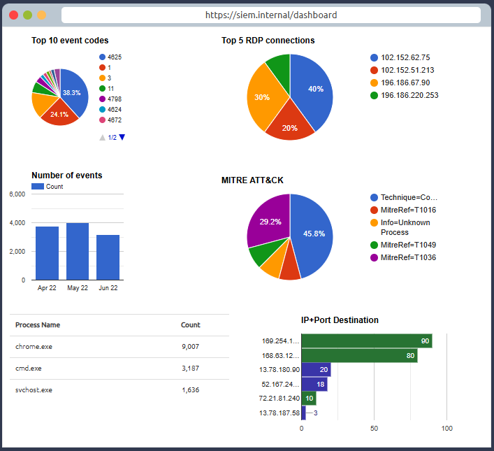
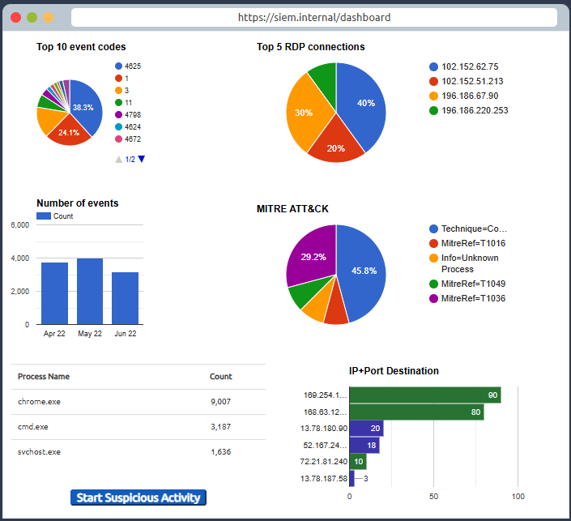
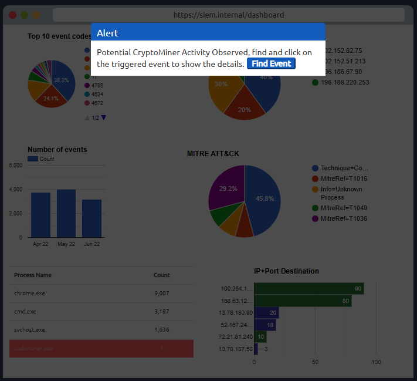
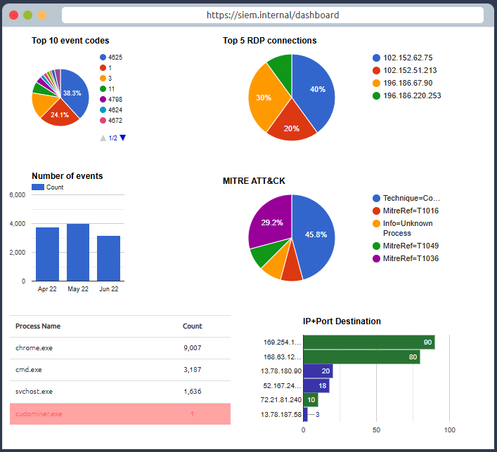
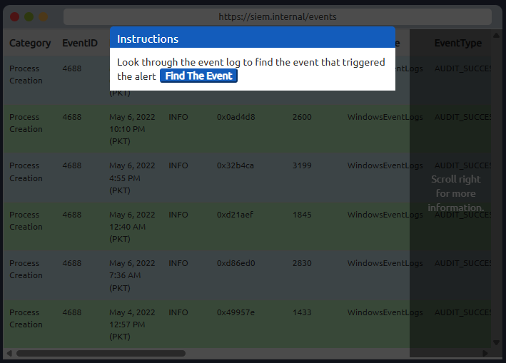
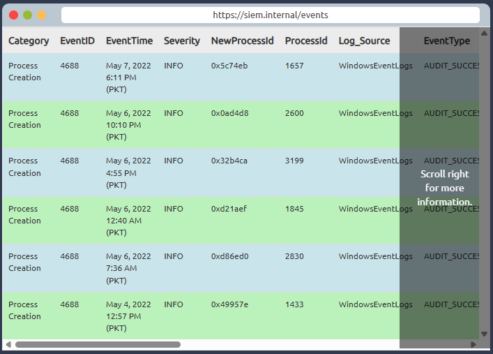
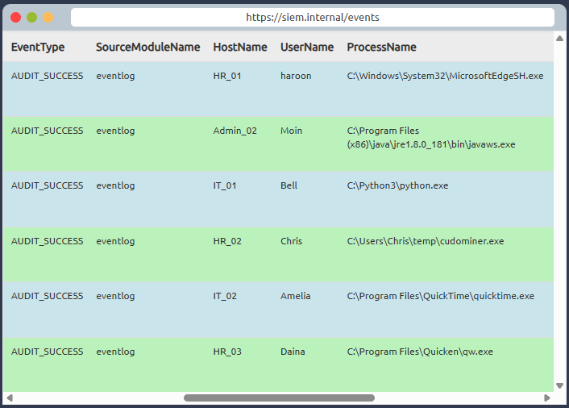
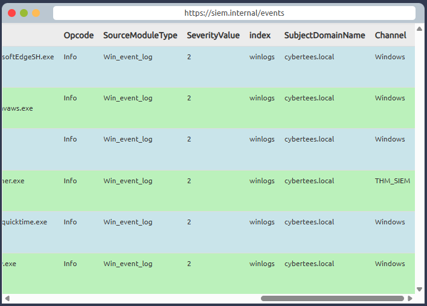

# Lab Work

## Cue

* SIEM dashboard
* Events monitoring
* Alert triggering
* Suspicious activity
* Detection rules
* Rule matching
* Alert investigation
* Event correlation
* Hands-on SIEM analysis

## Notes

* Lab menampilkan:

  * Sample SIEM dashboard
  * Events logs
  * Triggered alerts

* Alert akan muncul ketika:

  * Aktivitas mencurigakan terjadi
  * Events memenuhi kondisi detection rule tertentu

* Konsep utama lab:

  * Monitoring events
  * Investigasi alerts
  * Analisis suspicious activity
  * Memahami hubungan antara logs dan rules

* Alur kerja SIEM dalam lab:

  1. Log sources menghasilkan events
  2. Logs dikirim ke SIEM
  3. SIEM melakukan:

     * Parsing
     * Normalization
     * Correlation
  4. Detection rules memonitor field-value tertentu
  5. Jika kondisi rule terpenuhi:

      ```txt
      Alert Triggered
      ```

* Analyst melakukan investigasi dengan:

  * Memeriksa dashboard
  * Melihat event details
  * Mengecek rule yang trigger
  * Menentukan:

    * True Positive
    * False Positive

* Tujuan lab:

  * Memahami workflow SIEM
  * Memahami proses alerting
  * Memahami analisis events
  * Belajar investigasi sederhana di SIEM dashboard

* Berikut gambar lab nya: 
  * 
  * 
  * 
  * 
  * 
  * 
  * 
  * 
  * 

## Summary

* Lab SIEM memperlihatkan bagaimana events dari berbagai log sources dianalisis menggunakan detection rules hingga menghasilkan alerts. Analyst kemudian melakukan investigasi terhadap alert tersebut untuk memahami aktivitas mencurigakan dan menentukan tindakan yang perlu diambil.
